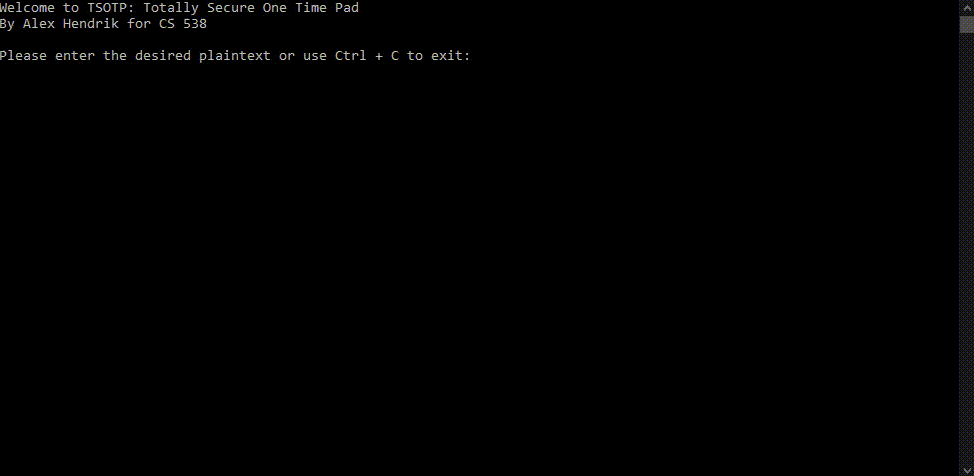

# OneTimePad
CS538-FA21

A simple One-Time-Pad implementation in C# for text encryption following Microsoft's guidelines for cryptographically secure key generation.

## Demo: 

## Important elements:
- All user input is sanitized for the inclusion of special characters.
- Intentional case-insensitivity to standardize all input data.
- Use of Microsoft's RandomNumberGenerator class, which is the approved standard for generating cryptographically strong random values in C#.
- True single use keys with immediate memory location cleaning and garbage collection.
- Generic XOR conversion function for both encryption and decryption.
- Immediate decryption output for verification purposes.
